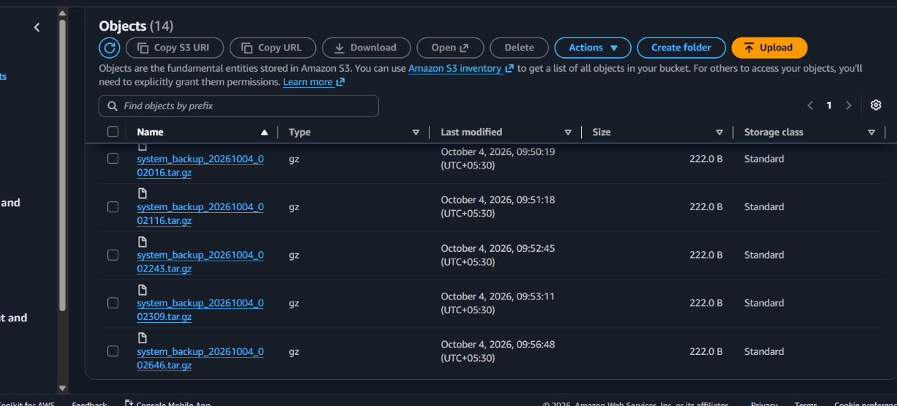

# Automated Production Backup Daemon

A modular, production-grade backup daemon built for Debian Linux. It archives system files, offloads them to AWS S3, cleans up old backups (locally and in the cloud), and sends real-time SMTP alerts on success or failure.

---

## Key Features

- **Automated Archiving**: Compresses designated target directories into timestamped `.tar.gz` archives.
- **AWS S3 Cloud Offloading**: Uploads archives directly to an S3 bucket using `boto3`.
- **Retention Management**: Automatically purges outdated archives both locally and on S3.
- **Dual Logging**: Writes structured logs to the terminal (stdout) and to `logs/backup.log` simultaneously.
- **Secure SMTP Alerting**: Sends email notifications on completion or failure over SSL/TLS (port 465).
- **Environment Isolation**: Uses relative path loading and `.env` files to keep credentials out of source code.

---

## Project Structure

```text
backup-daemon/
├── config/
│   └── config.json          # System and email configuration
├── docs/
│   └── s3.png               # S3 proof-of-execution screenshot
├── logs/
│   └── backup.log           # Application logs
├── src/
│   ├── backup.py            # Local archiving logic
│   ├── logger.py            # Dual-handler logging configuration
│   ├── notifier.py          # SMTP email dispatch module
│   └── sync.py              # AWS S3 sync & retention management
├── .env                     # Sensitive environment variables (not committed)
├── .gitignore               # Ignored files (logs, credentials, virtualenv)
├── main.py                  # Daemon orchestration entry point
├── README.md                # Project documentation
└── venv/                    # Python virtual environment
```

---

## Setup & Configuration

### 1. Prerequisites

- **OS**: Debian / Ubuntu Linux
- **Python**: 3.10 or newer
- **AWS**: An S3 bucket and an IAM user with access keys
- **Email**: A Gmail account with 2-Step Verification enabled and an [App Password](https://myaccount.google.com/apppasswords) generated

### 2. Installation

```bash
git clone <your-repo-url> backup-daemon
cd backup-daemon

python3 -m venv venv
source venv/bin/activate

pip install boto3 python-dotenv
```

### 3. AWS Authentication

The daemon uses `boto3` to talk to S3. You can authenticate in one of two ways.

#### Option A: AWS CLI configuration

If the AWS CLI is already configured on your system, `boto3` automatically loads credentials from `~/.aws/credentials`:

```bash
aws configure
```

#### Option B: Environment variables (`.env`)

If the AWS CLI is not configured, define your AWS keys in the `.env` file in the project root.

### 4. Environment Variables (`.env`)

Create a `.env` file in the project root.

**With Option B (no AWS CLI):**

```env
AWS_ACCESS_KEY_ID="your_aws_access_key"
AWS_SECRET_ACCESS_KEY="your_aws_secret_key"
EMAIL_SENDER_PASSWORD="your_16_digit_app_password"
```

**With Option A (AWS CLI configured):** only the email password is needed.

```env
EMAIL_SENDER_PASSWORD="your_16_digit_app_password"
```

> **Security note:** Never commit `.env` to version control. Make sure it is listed in `.gitignore`. If keys are ever exposed, rotate them immediately in the AWS IAM console.

### 5. Application Settings (`config/config.json`)

```json
{
  "backup_sources": [
    "/home/vinoth/MyBackups"
  ],
  "local_backup_dir": "/home/vinoth/backups",
  "retention_days": 7,
  "s3": {
    "enabled": true,
    "bucket_name": "system-backups-s3-buckets",
    "region": "us-east-1"
  },
  "email_notifications": {
    "enabled": true,
    "smtp_server": "smtp.gmail.com",
    "smtp_port": 465,
    "sender_email": "vinothdilshanbvd@gmail.com",
    "receiver_email": "vinothdilshanbvd@gmail.com"
  }
}
```

### Configuration Parameters

| Key | Description |
| :--- | :--- |
| `backup_sources` | List of target directories to archive |
| `local_backup_dir` | Local storage path for `.tar.gz` archives |
| `retention_days` | Age limit (in days) before purging archives locally and on S3 |
| `s3.enabled` | Toggle for S3 upload and cloud retention |
| `s3.bucket_name` / `s3.region` | Target AWS S3 bucket name and its region |
| `email_notifications.enabled` | Toggle for automated SMTP alerts |
| `smtp_server` / `smtp_port` | SMTP server host and SSL port (`465`) |
| `sender_email` / `receiver_email` | Alert sender and recipient addresses |

---

## Execution

Run the backup orchestration script manually:

```bash
source venv/bin/activate
python3 main.py
```

Logs are printed to the terminal and appended to `logs/backup.log`.

---

## Proof of Execution (AWS S3)



*Verified `.tar.gz` backup archives uploaded to the target AWS S3 bucket.*

---

## Status & Future Roadmap

- [x] Core local backup creation
- [x] AWS S3 upload & cloud retention
- [x] Dual console/file logging
- [x] SMTP email alerts via SSL (port 465)
- [ ] Systemd service & timer automation *(next phase)*
- [ ] Automated disk space health checks *(next phase)*

---

